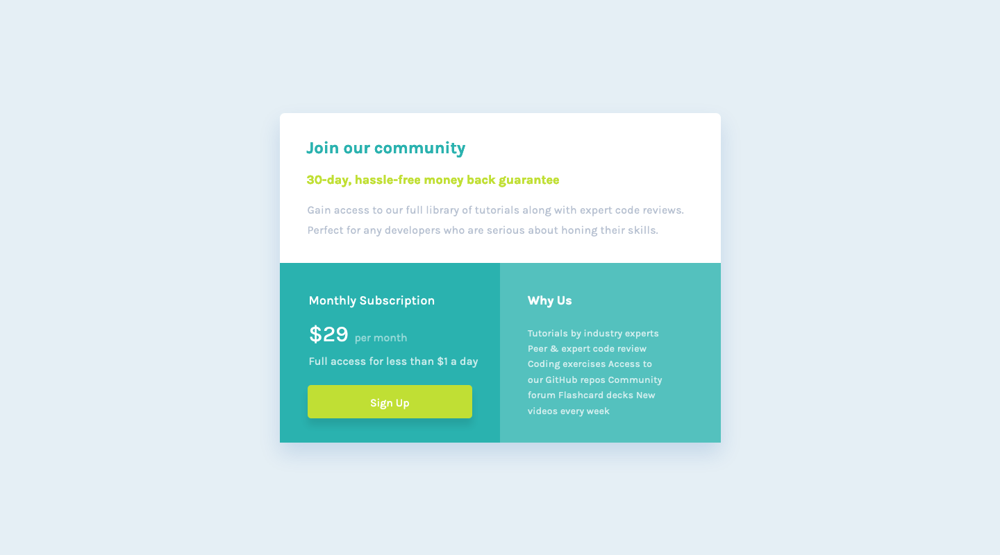

# Frontend Mentor - Four card feature section solution

This is a solution to the [Four card feature section challenge on Frontend Mentor](https://www.frontendmentor.io/challenges/four-card-feature-section-weK1eFYK). Frontend Mentor challenges help you improve your coding skills by building realistic projects. 

## Table of contents

- [Overview](#overview)
  - [The challenge](#the-challenge)
  - [Screenshot](#screenshot)
  - [Links](#links)
- [My process](#my-process)
  - [Built with](#built-with)
  - [What I learned](#what-i-learned)
  - [Continued development](#continued-development)
  - [Useful resources](#useful-resources)
- [Author](#author)
- [Acknowledgments](#acknowledgments)


## Overview

Coding Time : 7 hrs 26 mins

### The challenge

Users should be able to:

- View the optimal layout for the site depending on their device's screen size

### Screenshot



### Links

- Solution URL: [GitHub](https://github.com/Drallas/Single-price-grid-component)
- Live Site URL: [GitHub Pages](https://drallas.github.io/Single-price-grid-component/)

## My process

### Built with

- Semantic HTML5 markup
- CSS
- JavaScript
- BEM

### What I learned

This time I didn't use a grid generator but coded it up myself from scratch, including a nice subtle box-shadow. 

```css
.grid-container {
  display: grid;
  margin: 0 auto;
  border-radius: 0.4375rem 0.4375rem 0 0;
  background-color: white;
  box-shadow: 0px 15px 30px 0px rgba(0, 81, 171, 0.15);
  width: 19.4375rem;
  max-height: 45.125rem;
  grid-template-columns: 1fr;
  grid-template-rows: 1fr 1fr 1fr;
  gap: 0px 0px;
  grid-template-areas:
    "join"
    "monthly"
    "why-us";
}
```
### Continued development

This is a component and i'm getting a bit more confident that i can make it. What i'm still doubting about is should i set the width fixed or let the companent shrink / grow on window resize. How do i determine this? For now it's set fixed, but i'm curious how this is professionaly solved.  

### Useful resources

To create a nice box-showdow I 'cheated' using a generator to accomplisha nice box shadow.

- [Box-Shadow Generator](https://html-css-js.com/css/generator/box-shadow/) 

- [CSS Box-Shadow](https://cssboxshadow.com/) 

## Author

- Frontend Mentor - [@Drallas](https://www.frontendmentor.io/profile/Drallas)
- Dev.to - [@Drallas](https://dev.to/drallas)


## Acknowledgments
Thanks to mentor Grace from Frontend Mentor to push me to refine the grid, avoid absolute values.